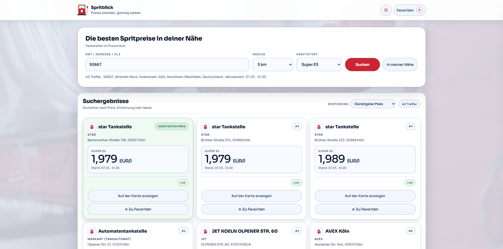

# Spritblick



Spritblick ist ein werbefreier Tankstellen-Preisvergleich mit Ortssuche, Standortsuche, Favoriten, Ranking und responsivem UI für Desktop und Mobile.

## Hintergrund

Spritblick entstand aus einem einfachen Alltagsproblem: Viele bestehende Tankpreis-Seiten sind überladen, werbelastig und gerade mobil unnötig unübersichtlich.

Die erste Version war eine kleine Vergleichsansicht für wenige feste Tankstellen. Daraus hat sich Schritt für Schritt eine flexiblere Web-App entwickelt, mit der sich Tankstellen in der Nähe gezielt suchen, filtern, sortieren und speichern lassen.

Der Fokus liegt auf einer klaren, ruhigen Nutzeroberfläche, schneller Orientierung und einer robusten serverseitigen Datenverarbeitung.

## Live-Demo

Die aktuelle Live-Version ist hier erreichbar:

`https://polarco.de/projekte/spritblick/demo`

## Features

- Freie Suche nach Ort, Adresse oder PLZ
- Standortsuche per Browser-Geolocation
- Filter nach Radius und Kraftstoffart
- Sortierung der Ergebnisse nach Preis, Entfernung und Name
- Hervorhebung des günstigsten Ergebnisses
- Favoriten speichern im Browser via `localStorage`
- Responsive UI für Desktop und Mobile
- Light-/Dark-Mode mit persistenter Speicherung
- Dynamische Kartenansicht mit Preis, Status und Stationsdetails
- Leere Zustände und klare Rückmeldungen bei fehlenden Treffern
- Serverseitiger API-Proxy zum Schutz des Tankerkönig-API-Keys

## Tech Stack

- HTML
- CSS
- Vanilla JavaScript
- PHP-Proxy mit Read-Proxy-Fallback
- Tankerkönig-API / MTS-K

## Projektstruktur

- `index.html` – Grundstruktur der Anwendung
- `styles.css` – Layout, Komponenten, Theme und Responsive Styles
- `script.js` – Suche, Rendering, Sortierung, Favoriten und Theme-Handling
- `api/prices.php` – serverseitiger Proxy für Suche, Nearby-Abfragen und Preisabruf
- `assets/` – Logos, Icons und weitere statische Assets

## Wichtiger Hinweis zur lokalen Nutzung

Dieses Repository enthält **keinen** Tankerkönig-API-Key.

Für Live-Daten ist ein eigener API-Key erforderlich, der selbst bei Tankerkönig beantragt und anschließend **serverseitig** eingerichtet werden muss.

Die öffentliche Live-Demo auf `polarco.de` nutzt eine separate Serverkonfiguration und ist **nicht** dafür gedacht, von lokal geklonten Instanzen oder fremden Deployments als allgemeiner API-Endpunkt verwendet zu werden.

## API-Key einrichten

Spritblick nutzt den Tankerkönig-API-Key ausschließlich serverseitig.

### Option 1: Umgebungsvariable setzen

```bash
set TANKERKOENIG_API_KEY=dein-key
```

### Option 2: Datei anlegen

```text
api/tankerkoenig.key
```

In diese Datei nur den API-Key schreiben, eine Zeile, ohne JSON.

**Wichtig:**  
Die Datei `api/tankerkoenig.key` darf nicht mit ins öffentliche Repository gelangen.

## Start (PHP)

Voraussetzungen:
- PHP 8.x
- cURL empfohlen

Im Projektordner starten:

```bash
php -S 127.0.0.1:8080
```

Danach im Browser öffnen:

```text
http://127.0.0.1:8080
```

## Lokale API-Endpunkte

Alle Endpunkte laufen über `api/prices.php`.

### Suche nach Ort / Adresse / PLZ

```text
action=search&q=Bad Honnef&radius=10&fuel=e5
```

### Suche in der Nähe

```text
action=nearby&lat=50.64&lng=7.22&radius=10&fuel=e5
```

### Preisabruf für bestimmte Stationen

```text
action=prices&ids=<uuid1>,<uuid2>&fuel=e5
```

## Aktueller Stand

Aktuelle Version: `v2.0.0`

## Hinweise

Die Tankerkönig-API unterliegt Nutzungsregeln, unter anderem sinnvollen Abfrageintervallen und einem sicheren Umgang mit dem API-Key.

Preisdaten: Tankerkönig / MTS-K unter CC BY 4.0

## Lizenz

Projekt: MIT (siehe `LICENSE`)

## Kontakt

Name: Michael Weißgerber  
E-Mail: michael [at] polarco.de  
Webseite: https://polarco.de
